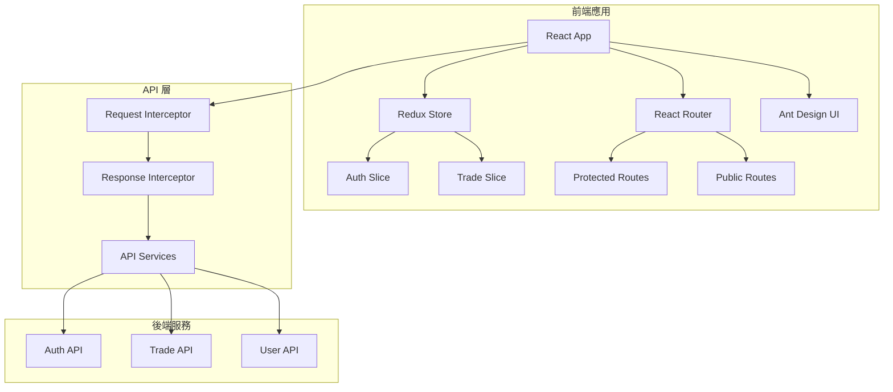
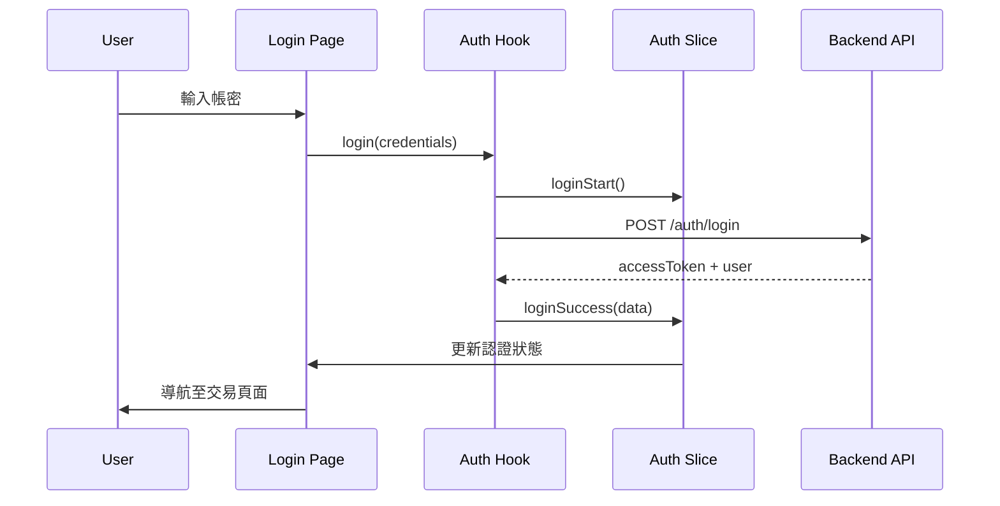
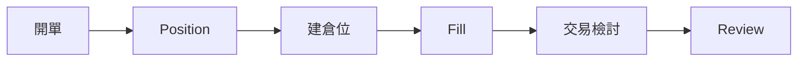

# 系統架構文檔

## 概述

Trado React 採用前後端分離的架構，前端使用 React + Redux 進行狀態管理，後端 API 透過 Axios 進行通訊。

## 架構圖



## 核心模組

### 1. 認證模組（Authentication）

**位置**：`src/store/authSlice.js`, `src/hooks/useAuth.js`

**功能**：
- 使用者登入/登出
- Token 管理
- 認證狀態管理
- 路由保護

**資料流**：


### 2. 交易紀錄模組（Transactions）

**位置**：`src/pages/Transactions/`

**功能**：
- 交易記錄列表顯示
- 開單（建立 Position）
- 建倉位（新增 Fill）
- 交易檢討
- 過濾與搜尋

**組件結構**：
```
Transactions/
├── index.jsx              # 主頁面組件
└── components/
    ├── AddPositionModal.jsx    # 開單彈窗
    ├── AddFillModal.jsx        # 建倉位彈窗
    └── TransactionDrawer.jsx    # 交易詳情抽屜
```

**資料流**：


### 3. 路由管理

**位置**：`src/App.jsx`

**路由結構**：
- **公開路由** (`/auth/*`)：
  - `/auth/login` - 登入頁面
  - `/auth/register` - 註冊頁面
  - `/auth/forgot-password` - 忘記密碼頁面

- **受保護路由** (`/`)：
  - `/transactions` - 交易紀錄頁面
  - `/trades` - 交易頁面
  - `/strategy` - 策略頁面（待開發）
  - `/settings` - 設定頁面（待開發）
  - `/profile` - 使用者資料頁面（待開發）

### 4. API 通訊層

**位置**：`src/api/`

**結構**：
- `request.js` - Axios 實例與攔截器
- `api_user.js` - 使用者相關 API
- `api_trade.js` - 交易相關 API

**攔截器功能**：
1. **請求攔截器**：
   - 自動添加 Authorization header
   - 從 sessionStorage 讀取 access_token

2. **響應攔截器**：
   - 統一處理錯誤
   - 自動刷新 Token（401 錯誤時）
   - 錯誤訊息格式化

## 狀態管理

### Redux Store 結構

```javascript
{
  auth: {
    user: null,
    isAuthenticated: false,
    isLoading: false,
    error: null
  },
  // 未來可擴展
  transactions: {
    list: [],
    filters: {},
    pagination: {}
  }
}
```

### 狀態持久化

使用 `redux-persist` 將認證狀態持久化到 localStorage。

## UI 組件架構

### 佈局組件

- **AuthLayout**：認證相關頁面的佈局（登入、註冊等）
- **MainLayout**：主要應用頁面的佈局（包含側邊欄、導航等）

### 共用組件

- **ProtectedRoute**：路由保護組件，檢查使用者認證狀態

### 頁面組件

每個頁面都是獨立的組件，位於 `src/pages/` 目錄下。

## 樣式管理

使用 SCSS 進行樣式管理，結構如下：

```
styles/
├── base.scss           # 基礎樣式
├── variables.scss      # 變數定義
├── mixins.scss         # Mixins
├── utils.scss          # 工具類
├── layouts/            # 佈局樣式
└── pages/              # 頁面樣式
```

## 開發規範

### 檔案命名
- 組件檔案：PascalCase（如 `TransactionDrawer.jsx`）
- 工具檔案：camelCase（如 `useAuth.js`）
- 樣式檔案：kebab-case（如 `transaction.scss`）

### 程式碼組織
- 每個組件應包含：變數、配置、函數、渲染邏輯
- 使用函數式組件與 Hooks
- 狀態管理優先使用 Redux，局部狀態使用 useState

### API 呼叫
- 統一使用 `src/api/` 下的 API 函數
- 使用 `await-to-js` 處理錯誤
- 錯誤訊息統一使用 Ant Design 的 `message` 組件顯示

## 未來擴展

1. **後端整合**：目前使用 mock 資料，未來需整合真實後端 API
2. **資料持久化**：將交易記錄儲存到資料庫
3. **統計分析**：增加更詳細的交易統計與分析功能
4. **匯出功能**：支援匯出交易記錄為 Excel/CSV
5. **即時通知**：交易提醒、價格警報等功能
