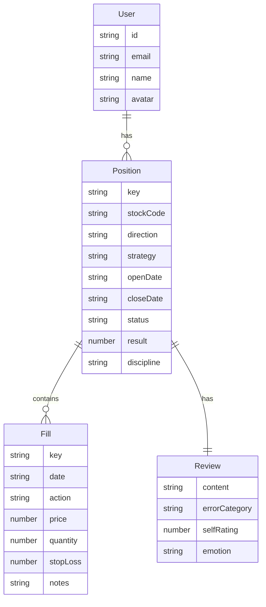

# 資料模型文檔

## 概述

本文檔描述 Trado React 系統中使用的資料結構和資料模型。

## 核心資料模型

### 1. Position（交易記錄）

Position 代表一筆完整的交易記錄，包含開單資訊、倉位變動和交易檢討。

```typescript
interface Position {
  // 識別資訊
  key: string;                    // 唯一識別碼（前端生成，使用 timestamp）
  index?: number;                 // 顯示編號（可選）
  
  // 基本資訊
  stockCode: string;              // 股號（4 位數字，如 "2330"）
  direction: 'LONG' | 'SHORT';    // 多空方向
  strategy: string;               // 策略名稱（如 "波段"、"乖離-2" 等）
  
  // 日期資訊
  openDate: string;               // 開倉日（格式：YYYY-MM-DD）
  closeDate: string | null;       // 清倉日（格式：YYYY-MM-DD，未清倉為 null）
  
  // 狀態與結果
  status: 'open' | 'completed';   // 狀態：持倉中 / 已完成
  result: number | null;          // 盈虧金額（元），未結算為 null
  discipline: 'pass' | 'fail' | 'pending';  // 紀律：通過 / 失敗 / 未處理
  
  // 倉位記錄
  fills: Fill[];                  // 倉位變動記錄陣列
  
  // 交易檢討
  review: Review;                 // 交易檢討資訊
  
  // 其他
  notes?: string;                 // 備註（選填）
}
```

**範例**：
```javascript
{
  key: '1704067200000',
  index: 1,
  stockCode: '2330',
  direction: 'LONG',
  strategy: '波段',
  openDate: '2024-01-15',
  closeDate: '2024-01-20',
  status: 'completed',
  result: 1500,
  discipline: 'pass',
  fills: [
    {
      key: '1',
      date: '2024-01-15',
      action: 'buy',
      price: 580.5,
      quantity: 1000,
      stopLoss: 575.0,
      notes: '突破阻力位進場'
    },
    {
      key: '2',
      date: '2024-01-20',
      action: 'sell',
      price: 582.0,
      quantity: 1000,
      stopLoss: null,
      notes: '獲利了結'
    }
  ],
  review: {
    content: '這次交易成功突破阻力位，按照策略執行，獲利了結。',
    errorCategory: 'none',
    selfRating: 4,
    emotion: 'confident'
  },
  notes: '觀察到成交量放大，確認突破有效'
}
```

### 2. Fill（倉位記錄）

Fill 代表一筆倉位變動記錄，記錄買入或賣出的詳細資訊。

```typescript
interface Fill {
  // 識別資訊
  key: string;                    // 唯一識別碼
  
  // 基本資訊
  date: string;                   // 日期（格式：YYYY-MM-DD）
  action: 'buy' | 'sell';         // 動作：買入 / 賣出
  price: number;                  // 價格（小數點後 2 位）
  quantity: number;               // 數量（整數）
  
  // 風險控制
  stopLoss: number | null;        // 停損價（小數點後 2 位，選填）
  
  // 其他
  notes?: string | null;          // 備註（選填）
}
```

**範例**：
```javascript
{
  key: '1',
  date: '2024-01-15',
  action: 'buy',
  price: 580.5,
  quantity: 1000,
  stopLoss: 575.0,
  notes: '突破阻力位進場'
}
```

### 3. Review（交易檢討）

Review 包含對該筆交易的檢討與反思。

```typescript
interface Review {
  content: string;                // 檢討內容（文字，最多 1000 字）
  errorCategory: string;          // 錯誤分類（見下方選項）
  selfRating: number;             // 自我評分（1-5，可為 0.5 的倍數）
  emotion: string;                 // 當時情緒（見下方選項）
}
```

**錯誤分類選項**：
```typescript
type ErrorCategory = 
  | 'technical'      // 技術分析錯誤
  | 'fundamental'    // 基本面分析錯誤
  | 'timing'         // 進出場時機錯誤
  | 'risk'           // 風險控制不當
  | 'emotion'        // 情緒影響判斷
  | 'strategy'       // 策略執行偏差
  | 'market'         // 市場環境誤判
  | 'other'          // 其他
  | 'none'           // 無錯誤
```

**情緒選項**：
```typescript
type Emotion = 
  | 'confident'      // 自信（綠色 #52c41a）
  | 'calm'           // 冷靜（藍色 #1890ff）
  | 'anxious'        // 焦慮（橙色 #faad14）
  | 'greedy'         // 貪婪（橙紅色 #ff7a45）
  | 'fearful'        // 恐懼（紅色 #ff4d4f）
  | 'frustrated'     // 沮喪（紫色 #722ed1）
  | 'excited'        // 興奮（粉紅色 #eb2f96）
  | 'neutral';       // 平靜（灰色 #8c8c8c）
```

**範例**：
```javascript
{
  content: '這次交易成功突破阻力位，按照策略執行，獲利了結。下次可以考慮分批出場以獲取更大收益。',
  errorCategory: 'none',
  selfRating: 4,
  emotion: 'confident'
}
```

### 4. User（使用者）

User 代表系統使用者。

```typescript
interface User {
  id: string;                     // 使用者 ID
  email: string;                   // 電子信箱
  name?: string;                   // 姓名（選填）
  avatar?: string;                 // 頭像 URL（選填）
  createdAt?: string;              // 建立時間
  updatedAt?: string;              // 更新時間
}
```

**範例**：
```javascript
{
  id: 'user_123',
  email: 'user@example.com',
  name: '張三',
  avatar: 'https://example.com/avatar.jpg',
  createdAt: '2024-01-01T00:00:00Z',
  updatedAt: '2024-01-15T10:30:00Z'
}
```

## 資料關係圖



## 資料驗證規則

### Position 驗證規則

| 欄位 | 必填 | 格式 | 說明 |
|------|------|------|------|
| stockCode | 是 | 4 位數字 | 如 "2330" |
| direction | 是 | 'LONG' 或 'SHORT' | 多空方向 |
| strategy | 是 | 字串 | 策略名稱 |
| openDate | 是 | YYYY-MM-DD | 開倉日 |
| closeDate | 否 | YYYY-MM-DD | 清倉日 |
| notes | 否 | 字串（最多 200 字） | 備註 |

### Fill 驗證規則

| 欄位 | 必填 | 格式 | 說明 |
|------|------|------|------|
| date | 是 | YYYY-MM-DD | 日期 |
| action | 是 | 'buy' 或 'sell' | 動作 |
| price | 是 | 數字（≥ 0，小數點後 2 位） | 價格 |
| quantity | 是 | 整數（≥ 1） | 數量 |
| stopLoss | 否 | 數字（≥ 0，小數點後 2 位） | 停損價 |
| notes | 否 | 字串 | 備註 |

### Review 驗證規則

| 欄位 | 必填 | 格式 | 說明 |
|------|------|------|------|
| content | 是 | 字串（最多 1000 字） | 檢討內容 |
| errorCategory | 是 | 預定義選項 | 錯誤分類 |
| selfRating | 是 | 數字（0.5-5，0.5 的倍數） | 自我評分 |
| emotion | 是 | 預定義選項 | 當時情緒 |

## 計算欄位

### Position 計算欄位

以下欄位由系統根據 fills 自動計算：

1. **總數量（totalQuantity）**：
   ```javascript
   let totalQuantity = 0;
   fills.forEach(fill => {
     if (fill.action === 'buy') {
       totalQuantity += fill.quantity;
     } else {
       totalQuantity -= fill.quantity;
     }
   });
   ```

2. **平均價格（avgPrice）**：
   ```javascript
   let totalValue = 0;
   let totalQuantity = 0;
   fills.forEach(fill => {
     if (fill.action === 'buy') {
       totalQuantity += fill.quantity;
       totalValue += fill.price * fill.quantity;
     } else {
       totalQuantity -= fill.quantity;
       totalValue -= fill.price * fill.quantity;
     }
   });
   const avgPrice = totalQuantity !== 0 ? totalValue / totalQuantity : 0;
   ```

3. **總價值（totalValue）**：
   ```javascript
   const totalValue = totalQuantity * avgPrice;
   ```

4. **盈虧金額（result）**：
   - 當 status 為 'completed' 時，根據所有 fills 計算總盈虧
   - 計算方式：賣出總額 - 買入總額

5. **狀態（status）**：
   - 當 closeDate 為 null 時，status 為 'open'
   - 當 closeDate 不為 null 時，status 為 'completed'

## 資料初始化

### 新建 Position 的預設值

```javascript
{
  key: Date.now().toString(),
  stockCode: '',
  direction: 'LONG',
  strategy: 'none',
  openDate: '',
  closeDate: null,
  status: 'open',
  result: null,
  discipline: 'pending',
  fills: [],
  review: {
    content: '',
    errorCategory: '',
    selfRating: 0,
    emotion: ''
  },
  notes: ''
}
```

### 新建 Fill 的預設值

```javascript
{
  key: Date.now().toString(),
  date: '',
  action: 'buy',
  price: 0,
  quantity: 0,
  stopLoss: null,
  notes: ''
}
```

## 資料持久化

### 目前實作

- 使用 React state 管理資料（mock 資料）
- 認證狀態使用 Redux Persist 持久化到 localStorage

### 未來規劃

- 將交易記錄儲存到後端資料庫
- 使用 RESTful API 進行 CRUD 操作
- 支援離線模式（使用 IndexedDB）

## 資料遷移

當資料結構變更時，需要考慮：

1. **向後相容性**：新版本應能讀取舊版本的資料格式
2. **資料遷移腳本**：提供遷移工具將舊資料轉換為新格式
3. **版本標記**：在資料中加入版本號，方便識別和遷移
